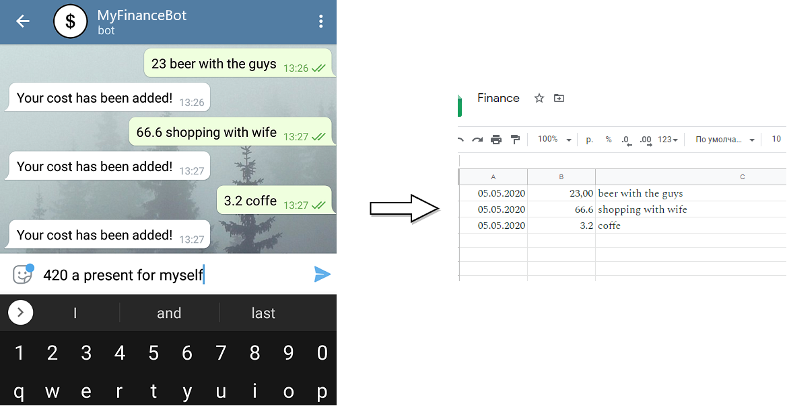

# Fingram

This Telegram messenger bot simply copies your costs that are provided with messages to the Google sheet.  
You then can use Google sheet to track all your costs using existing or creating personal financial templates.  
Bot consider to be private, meaning you specify which Telegram accounts can interact with the bot.




## Usage
### Prerequisites
1. You need to create a new Google APP project, enable Sheets and Drive API for it and create a service account.  
More information on that can be found within Google developer docs, but it's really not necessary to go deeper into that and I'd say that steps from the pygsheet documentation should be enough for our needs:  
https://pygsheets.readthedocs.io/en/latest/authorization.html  
Needed artifacts from this step - service account email and service account secret key (json-formatted).  

2. You need to register a new Telegram bot.  
Write to Bot Father https://t.me/botfather and follow the instructions.  
Needed artifacts from this step - telegram bot token.  

### Configuration
1. Create a Google sheet under your account and share the sheet with your service account email.  
This will get your application an access to write costs.  

2. Fill in `variables.json` with correct parameters:  
* `service_secret` is a json file with a service secret key you have for your google app  
* `sheets` section maps telegram user id to the google sheet used to write the data. That is a link to the google sheet created in the previous step. Multiple telegram accounts with their own google sheets can be specified. Only telegram IDs specified within this section are allowed to use the bot. If you don't know your telegram id, you can simply print `message.from_user.id` value within the `bot.py`  to get it  
* `token` within the `telegram` section is the Telegram token of your bot  

### Deployment
To run the bot, install required packages using pip at first and issue the `python3 bot.py` command. That's it.  
Docker can also be used to run the app, just run:  
```
docker run -v --rm --name fingram -v $(pwd):/opt/fingram/vars spolikarpov/fingram:latest
```
where `$(pwd)` contains `variables.json` and `service_acc_secret.json` files.  

### Deployment on a remote machine
In case you want to deploy this app on a remote server, a build-in ansible `provision.yml` can be used.  
First you need to export environment variables with your local variables and secret key files:
```
export FINGRAM_LOCAL_VARS="variables.local.json"
export FINGRAM_ACC_SECRET="service_acc_secret.json"
```
Then simply run a playbook specifying remote machine address:
```
ansible-playbook -i '13.13.13.13, ' provision.yml
```

### Building
Dockerfile for the bot is also included within this repo, so you can build and run a container as follow:
```
[root@ fingram]# docker build -t fingram .
[root@ fingram]# docker run --name fingram -v $(pwd):/opt/fingram/var -d fingram
d96f6af5de4ec45c87decc7fd72fe2324de209cc2842277fdf3ee48ec4eeaa63
[root@ fingram]# docker ps
CONTAINER ID        IMAGE                            COMMAND                  CREATED             STATUS              PORTS                  NAMES
d96f6af5de4e        fingram                          "python /opt/fingr..."   2 seconds ago       Up 1 second                                fingram
[root@ fingram]#
```


